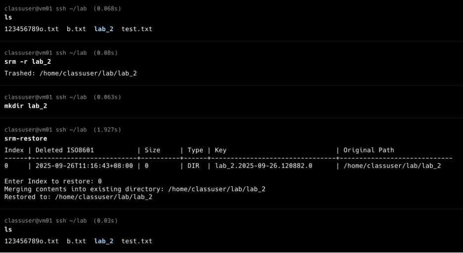

# Smart Trash Can System Setup Report

## 1. System Design Overview

The Smart Trash Can system includes three main commands: `srm`, `srm-restore`, and `srm-empty`. These utilities are designed to provide a safer file deletion experience by allowing for temporary deletion, recovery, and automated cleanup.

### 1.1 `srm`: Safe Remove


* **Functionality**: Temporarily deletes files or directories by moving them to a trash folder (`~/.trash/files`) and saving their metadata in `~/.trash/meta`.
* **Usage**:

  * `srm file.txt`: Moves `file.txt` to trash.
  * `srm -r folder`: Moves a folder and its contents recursively.
* **Design Logic**:

  * Each deletion generates a metadata file recording:
    * original path
    * deletion timestamp
    * file name
  * A timestamp-based UUID is used to differentiate between entries.
  * Files are moved, not removed, for easy restoration.

* **My Additional Design Choices:**

	* Use realpath to ensure metadata always stores the absolute path, avoiding confusion with . or relative paths.
	* Add an explicit TYPE field (FILE or DIR) in metadata for clarity, instead of inferring type later.
	* Block users from accidentally deleting the trash folder itself.

### 1.2 `srm-restore`: Restore Deleted Items



* **Functionality**: Restores files or directories from the trash to their original location.
* **Logic**:

  * Reads metadata from `~/.trash/meta`.
  * If the original path no longer exists, it will create the parent directories as needed.
  * If the original path exists **and** the same-named file/folder already exists, it will restore using a new name (e.g., `filename.restore-1`).

* **My Additional Design Choices:**

	* For restoring directories: if the target directory already exists, merge contents instead of blindly renaming. For each conflicting file inside, automatically append .restored.<timestamp>.
	* After restoring, the associated metadata and trash file are deleted.

### 1.3 `srm-empty`: Periodic Cleanup


* **Functionality**: A background service to clean up trash older than a defined threshold (default 7 days).
* **Logic**:

  * Scans `~/.trash/meta` and compares timestamps.
  * Deletes both the file and its metadata if older than the threshold.
  * Integrated with systemd timer to run automatically every day.

## 2. Project Structure and Setup

### 2.1 Repository Layout

```
hw1/
├── bin/
│   ├── srm             # Safe remove command
│   ├── srm-restore     # Restore command
│   └── srm-empty       # Cleanup command
└── user/
    ├── srm-empty.service       # systemd service definition (runs once)
    ├── srm-empty.timer         # systemd timer (triggers service daily)
    └── timers.target.wants/
        └── srm-empty.timer     # symlink to enable timer by default
```

### 2.2 Installing and Integrating the Utilities

To make these tools behave like native commands:

1. **Clone the repo and link to PATH**:

   ```bash
   git clone https://github.com/Ocean1029/LSAP.git
   cd LSAP/hw1
   mkdir -p ~/.local/bin
   ln -s "$PWD/bin/srm" ~/.local/bin/srm
   ln -s "$PWD/bin/srm-restore" ~/.local/bin/srm-restore
   ln -s "$PWD/bin/srm-empty" ~/.local/bin/srm-empty
   ```

2. **Add ~/.local/bin to PATH** (if not already):

   ```bash
   echo 'export PATH="$HOME/.local/bin:$PATH"' >> ~/.bashrc
   source ~/.bashrc
   ```

3. **Enable the systemd timer**:

   ```bash
   mkdir -p ~/.config/systemd/user
   cp -r user/* ~/.config/systemd/user/
   systemctl --user daemon-reexec
   systemctl --user daemon-reload
   systemctl --user enable srm-empty.timer
   systemctl --user start srm-empty.timer
   ```

---

## 3. Usage Instructions


### 3.1 Deleting Files

```bash
srm important.txt
```

Moves `important.txt` to `~/.trash/files` and records metadata in `~/.trash/meta`.

* **Recursive delete**:

```bash
srm -r my_folder
```

### 3.2 Restoring Files

```bash
srm-restore
```

Interactive menu appears with table of items. Choose an index to restore.

### 3.3 Automatic Cleanup

You can cleanup the trash can manually by `srm-empty`, or The systemd timer runs `srm-empty` daily. Example log:

```bash
Purged 2 item(s) older than 7 day(s).
```

---

## 4. Timer & Service Mechanism

This project leverages **systemd user services** for automated cleanup.

### 4.1 `srm-empty.service`

```ini
[Unit]
Description=Smart Trash Can cleanup service

[Service]
ExecStart=%h/bin/srm-empty
```

### 4.2 `srm-empty.timer`

```ini
[Unit]
Description=Run srm-empty daily

[Timer]
OnCalendar=daily
Persistent=true

[Install]
WantedBy=timers.target
```

### 4.3 Enabling the Timer

```bash
systemctl --user enable srm-empty.timer
systemctl --user start srm-empty.timer
```

Logs can be checked with:

```bash
journalctl --user -u srm-empty.service
```
	
### 4.4 Testing the Service

To manually test if the service runs correctly:

```bash
systemctl --user start srm-empty.service
```

Then check output logs:

```bash
journalctl --user -u srm-empty.service -n 20
```

If it shows something like:

```
Purged 0 item(s) older than 7 day(s).
```

then the service has executed successfully.
